<h1 align="center">Flipendo</h1>

<p align="center">
  <strong>Motor de juego en C++ para macOS con Metal.</strong><br>
  Un fork de <a href="https://github.com/UPBGE/upbge">UPBGE</a> / Blender 4.5 al que le estamos quitando el intérprete de Python.
</p>

<p align="center">
  
  
  
  
  
</p>

<p align="center">
  <a href="#compilar-macos-intel">Compilar</a> ·
  <a href="#ánima--el-juego-que-se-hace-con-él">El juego</a> ·
  <a href="#metas-cercanas">Metas</a> ·
  <a href="#comparativa-flipendo-upbge-unreal-y-unity">Comparativa</a> ·
  <a href="politicas/">Doctrina y estado</a>
</p>

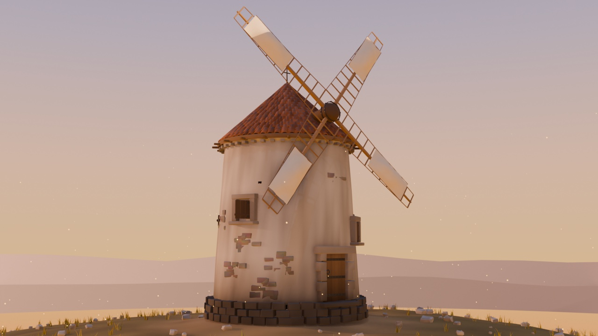


Blender eliminó el soporte de macOS Intel en la versión 5.0, y con él murió la línea de UPBGE para estos equipos: el último binario oficial es UPBGE 0.44, y su backend Metal viene a medias — **medido en este proyecto**: los filtros 2D ni compilan y `bge.texture` responde `Texture is not available`. Flipendo continúa esa línea por su cuenta: base de Blender 4.5 + game engine, compilado y probado en hardware real (MacBook Pro 2019, Radeon Pro 5300M).

Lo que empezó como mantener viva una línea abandonada se ha convertido en algo más concreto: **quitarle el intérprete de Python al motor** y dejar una base de C++ sobre la que se pueda construir de verdad.

---

## ÁNIMA — el juego que se hace con él

**ÁNIMA** es un Action-RPG de aventura, con la escala visual de la generación PS2 y Kingdom Hearts como referencia de estructura. Es el proyecto que justifica el motor y el que marca qué hay que arreglar.

### El molino de La Mancha

La pieza que fija el listón de calidad. **67.989 caras**, modelado real y no primitivas: 661 tejas colocadas una a una en 19 hiladas, 120 sillares individuales en el zócalo, aspas con travesaños y lona con panza, y 11 desconchones donde la cal se cayó y asoma la mampostería.

| | |
|---|---|
|  | 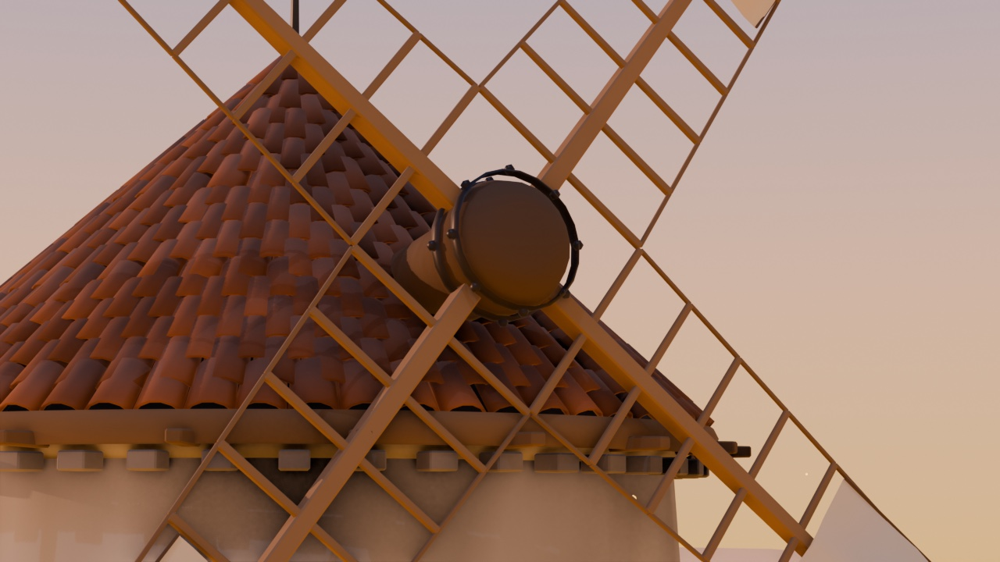 |
| El molino sobre su cerro | Aspas: verga, travesaños y lona |
| 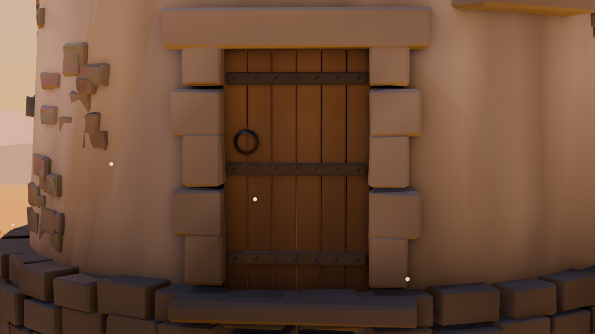 | 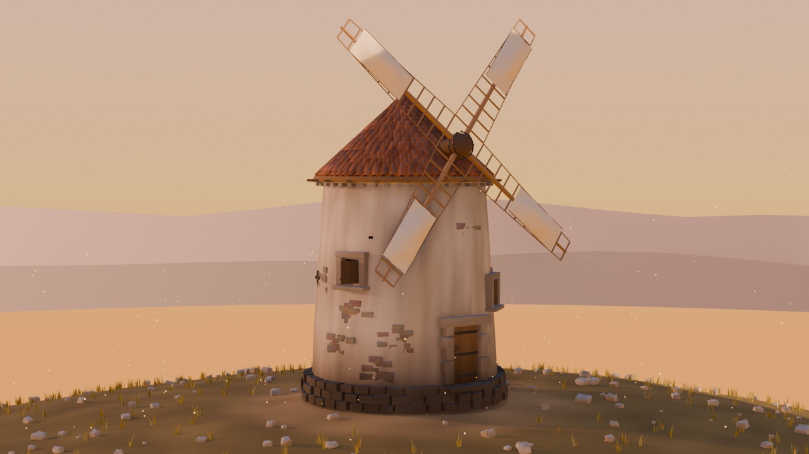 |
| Jambas de sillería alternando soga y tizón, herrajes y aldaba | La silueta contra el atardecer |

### Por dentro

| | |
|---|---|
| 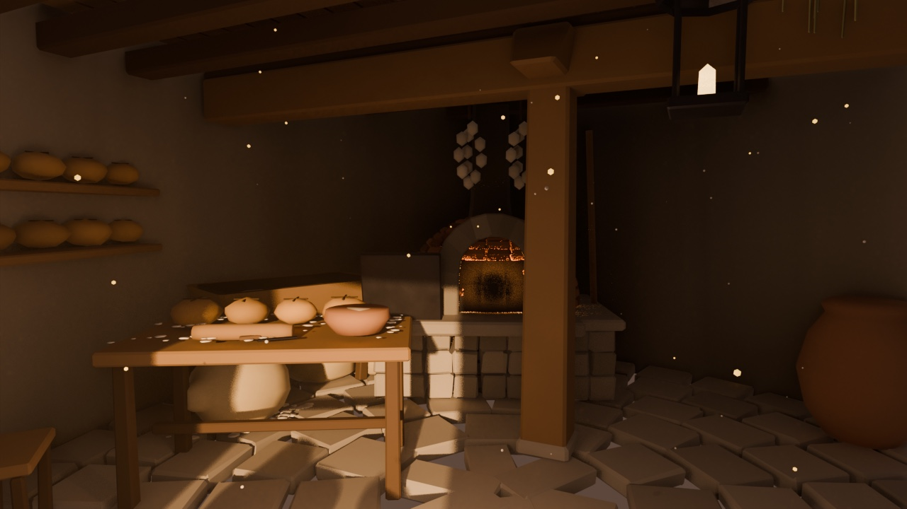 | 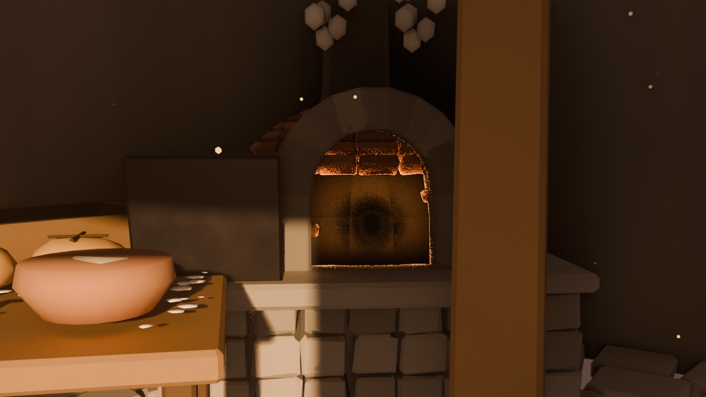 |
| La sala, con el pan sobre la mesa | El horno encendido |
| 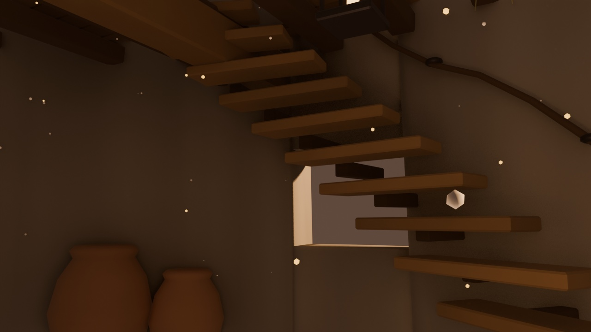 | 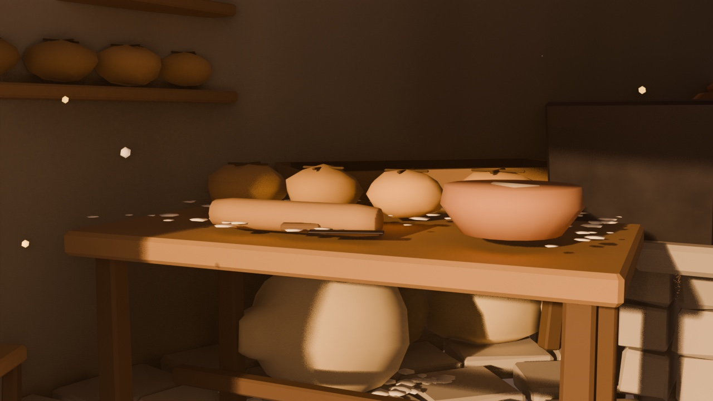 |
| Escalera al piso de la molienda | Detalle de la mesa |

### Terreno 1 — La Mancha

El primer mapa jugable: pueblo, camino, arroyo con puente y la colina de los molinos. 300×300 m.

| | |
|---|---|
| 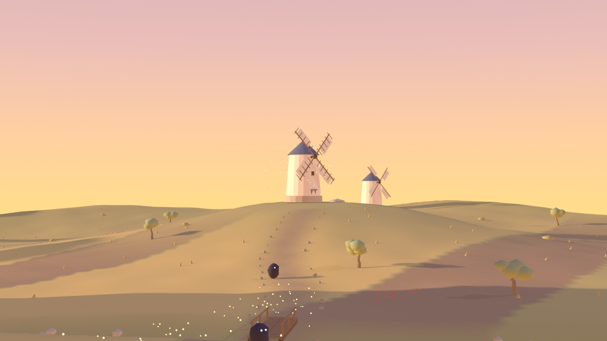 | 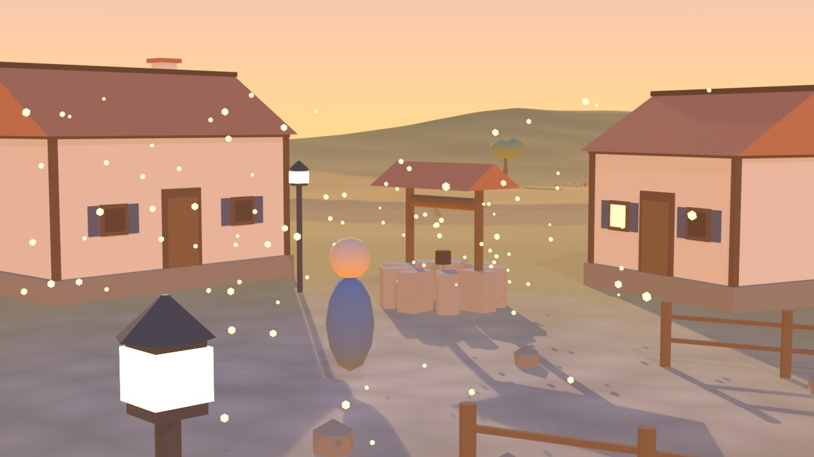 |
| La colina de los molinos al atardecer | La plaza, con el pozo y los faroles |
|  | 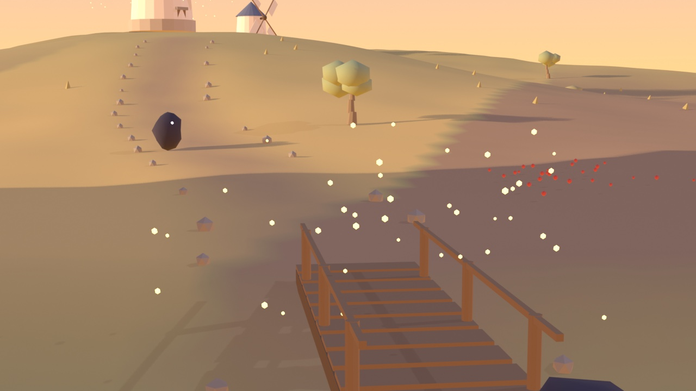 |
| El camino que sube al molino | El puente sobre el arroyo seco |

> **Honestidad sobre estas imágenes.** El molino es la pieza héroe, con el nivel de detalle al que va todo lo demás. El mapa T1 es de una fase anterior y todavía usa formas simples; el maniquí que se ve en la plaza es un **placeholder** hasta tener el modelo del protagonista, y los enemigos son bultos deliberadamente abstractos porque su diseño está sin decidir. Ninguno de los dos `.blend` contiene una sola línea de Python: el gameplay se ata con componentes nativos en C++.

---

## Metas cercanas

Cuatro, en este orden.

### 1. C++ completo

Ni una línea de Python en el motor. No es una limpieza estética: mientras el keymap por defecto salga de un script, **el juego exportado tiene que cargar un intérprete entero** para saber qué hace la tecla `G`.

Estado real. Las cifras de abajo están medidas el **2026-09-11** sobre el commit
`bdf77abfbba`, con `git` y no con el contador del proyecto (ver la nota al pie):

| | |
|---|---|
| C propio (fuera de `extern/` y `lib/`) | **0 ficheros** |
| Shell propio y presets en `.py` | **0 ficheros** |
| Componentes de gameplay | **100% C++** (`FL_Component`; el sistema Python fue eliminado) |
| Mapa de teclado por defecto | **248/248 keymaps en C++** y **3.673/3.673 atajos**, idénticos a los que generaba Python |
| Sistema de herramientas | **100% C++, sin una sola línea de Python**: catálogo, activación, consultas, operadores, barra, ajustes, cabecera, reserva y keymap del popup. Verificado contra el Python real (416 + 474 + 416 + 912 casos), la barra y la cabecera píxel a píxel |
| Editor de nodos | `space_node.py` pasa de **1.063 líneas y 34 clases a 84 y 7**; los otros **27 tipos** viven en `fl_node_ui.cc`. Verificado: diseño **2.004/2.004** bloques idénticos, registro **2.110/2.113** |
| Presets | **172 ficheros de datos `.fpreset`, 0 de código**. Eran 173 `.py`, que el editor ejecutaba con `bpy.utils.execfile` |
| Publicar y exportar el juego | **operadores nativos en C++** (`source/blender/editors/flipendo/`, 1.965 líneas) en lugar de los cinco add-ons Python, dos de ellos rotos desde 2019 |
| Interfaz de juego nativa | lienzo en C++ (`FL_UiCanvas`) y **4 de los 9 widgets** de `bgui` (`Frame`, `Label`, `FrameButton`, `Image`). **Aún no cubre la capacidad entera** |
| El build necesita Python | **no** para `--target install`: ninguna orden de `build.ninja` invoca un intérprete. Solo lo usa el target `package_archive`, que no compila nada |
| Player sin CPython | **compila y juega** — 0 símbolos `_Py`, 538 MB frente a 762 MB |
| Ficheros `.py` dentro del juego exportado | **0** (el Player con Python lleva 2.022) |
| Python restante | **191.224 líneas en 613 ficheros**. De ellas, 119.105 son el editor (`scripts/`), 44.842 los tests, 14.649 las herramientas de desarrollo y 12.628 el resto. Al empezar el proyecto eran **492.366**: **−61,2 %** |
| Objective-C++ | **22.289 líneas en 25 ficheros**. El frente vivo es el backend Metal: **11 ficheros, 12.703 líneas**; la capa de cabeceras ya es C++ puro, y lo que hay que reescribir son envíos de mensaje, no líneas |
| Verificadores integrados en el binario | **46**: 16 `--fl-check-*`, 14 `--fl-dump-*` y 16 `--fl-selftest-*`, de **50 opciones `--fl-*`** registradas en `creator_args.cc` |

**Cómo se verifica.** Nada se da por migrado leyendo el código: se congela lo que produce el Python y el C++ tiene que reproducirlo exactamente. Para la interfaz, eso significa capturas. Cada par de columnas es la barra de herramientas del mismo editor y modo, dibujada por **Python a la izquierda** y por **C++ a la derecha** — vista 3D en modo objeto, edición y escultura; editor UV, nodos y secuenciador:

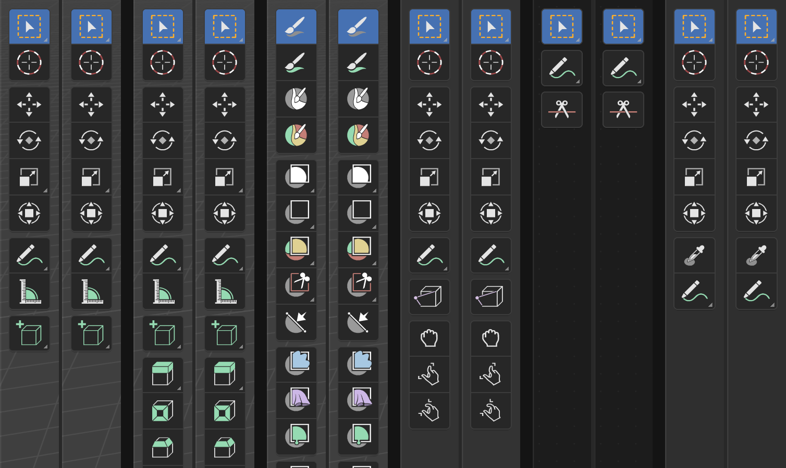

*Las seis parejas son idénticas píxel a píxel. La barra ya no ejecuta Python en cada redibujado.*

Lo que queda es el editor: paneles, operadores y el puente CPython. La infraestructura para migrarlo ya existe (`FL_ui_registry`) y el editor de lógica es el piloto que la valida.

> **Cómo leer estas cifras.** Se miden con `git` a un commit nombrado, nunca al árbol
> de trabajo, porque el árbol tiene trabajo a medias de varios frentes a la vez. Las
> cifras que circularon por el repositorio hasta el 10 de septiembre van **ligeramente
> altas**: el contador del proyecto sumaba una línea de más por fichero. Ya está
> corregido; el método, y qué decía cada cifra antes, están en
> [`politicas/METRICAS.md`](politicas/METRICAS.md).

### 2. Velocidad, y ganarle a la competencia en Mac

Que abra antes, cargue antes y vaya más fluido que las alternativas **en el hardware que la gente tiene**, no en una estación de trabajo. Menos indirección, menos capas, y el intérprete fuera del bucle de frame.

### 3. Instalador rápido y bien comprimido

Un instalador nativo de macOS, pequeño y que termine rápido. Quitar CPython ya se llevó 235 MB por delante; el objetivo es seguir bajando y que instalar sea cuestión de segundos.

### 4. Ordenar la casa

Blender y UPBGE arrastran décadas de capas superpuestas. Organizar lo heredado y lo añadido en una base coherente, para que "añadir una función" no signifique pelearse con tres subsistemas a la vez. Sin esto, las otras tres metas se deshacen con el tiempo.

---

## Comparativa: Flipendo, UPBGE, Unreal y Unity

Contexto honesto: Unreal y Unity son ecosistemas industriales con miles de personas detrás; Flipendo lo mantiene una persona, con un nicho concreto — **que un Mac siga siendo ciudadano de primera y que el flujo de trabajo viva dentro de Blender**. Esta tabla existe para elegir herramienta con datos, no para pretender otra cosa.

> **Hasta dónde llega esta tabla.** La columna de Flipendo está medida en este árbol
> y se puede comprobar. Las de **UPBGE 0.50, Unreal y Unity no**: son documentación
> pública y precios, leídos antes del **2026-09-11**, que cambian sin avisar y que
> aquí nadie ha podido verificar. Están marcadas con *(sin verificar)* y sirven para
> orientarse, no como dato. Antes de decidir con ellas, compruébalas en la fuente.

| | **Flipendo** | **UPBGE 0.50+** *(sin verificar)* | **Unreal Engine 5** *(sin verificar)* | **Unity 6** *(sin verificar)* |
|---|---|---|---|---|
| **macOS Intel (x86_64)** | ✅ objetivo principal, build nativo Metal | ❌ eliminado: 0.50 se basa en Blender 5.0, que ya no publica `macos-x64` | ⚠️ el editor arranca, pero Nanite/Lumen no están disponibles en esta GPU y el foco declarado es Apple Silicon | ⚠️ el editor aún corre en Intel, pero el foco declarado es Apple Silicon |
| **Editar y jugar sin exportar** (el editor ES la herramienta 3D) | ✅ es Blender: modelas, animas y pulsas P | ✅ ídem | ❌ pipeline de importación desde la DCC | ❌ pipeline de importación desde la DCC |
| **Lenguaje de juego** | **C++ nativo** (`FL_Component`); el sistema de componentes Python fue eliminado | Python + logic bricks + nodos | C++ y Blueprints | C# |
| **Intérprete en el juego exportado** | **ninguno** — medido: 0 símbolos `_Py` y 0 ficheros `.py` en el bundle del Player | CPython embebido | ninguno (C++ compilado) | Mono/IL2CPP |
| **Tamaño del runtime** | **538 MB**, frente a los 762 MB del mismo Player con CPython (`du -sh`, 2026-09-11) | no medido aquí | no medido aquí; el orden de magnitud que se cita es de 1 GB por proyecto vacío | varía mucho según backend y plataforma |
| **Post-proceso en Mac Intel** | ✅ filtros 2D en Metal (arreglado en este fork; acepta también la sintaxis GLSL antigua de los tutoriales) | ❌ en 0.44/macOS ni compilaba; 0.50 no existe para Intel | ✅ | ✅ |
| **Render-to-texture en Mac Intel** (espejos, minimapas, CCTV) | ✅ restaurado **y nativo en C++**: funciona en el Player sin intérprete | ❌ (mismo motivo) | ✅ | ✅ |
| **Motor de render** | EEVEE (rasterizador tiempo real de Blender) | EEVEE | Nanite+Lumen (no en Mac Intel), rasterizador clásico como alternativa | URP / HDRP |
| **Plataformas de exportación** | macOS, y solo macOS: el soporte Win/Linux heredado de UPBGE se **podó a propósito** (no queda ningún `platform_windows`/`platform_unix` en `build_files/cmake/platform/`, ni ningún GHOST de Win32/X11/Wayland) | Windows, Linux, macOS ARM | Todas: PC, consolas, móvil | Todas: PC, consolas, móvil, web |
| **Licencia y coste** | GPL-2.0+, gratis, código abierto completo | GPL-2.0+, gratis | de pago por royalties a partir de cierto volumen de ingresos, y con licencia por asiento en usos no-videojuego; código fuente visible pero no libre. **Epic ha cambiado estas condiciones más de una vez: mira la licencia vigente** | plan gratuito con tope de ingresos y suscripción por asiento por encima; código cerrado. **Unity también las ha cambiado más de una vez: mira la vigente** |
| **Asset store / ecosistema** | ❌ (lo que haya para Blender) | pequeño | enorme | enorme |
| **Add-ons de terceros** | ❌ en el juego exportado, y **por diseño**: sin intérprete no hay add-ons Python. El editor todavía lleva intérprete mientras dura la migración, así que ahí sí funcionan | ✅ | ✅ plugins C++ | ✅ paquetes C# |
| **Madurez / riesgo** | ⚠️ fork joven de una persona; historia corta y verificada commit a commit | comunidad pequeña, desarrollo activo | industria AAA | industria, muy extendido en indie/móvil |
| **Para quién tiene sentido** | tienes un Mac, quieres flujo 100% Blender y un motor GPL sin intérprete que puedas tocar por dentro | mismo perfil, pero quieres scripting en Python y multiplataforma | equipo/proyecto AAA o portfolio industrial, hardware moderno | indie multiplataforma, móvil, ecosistema C# |

La fila que más cambia el cálculo es la de add-ons: quitar Python **cuesta** el ecosistema de scripts de terceros. Es un intercambio deliberado — arranque más rápido, runtime más pequeño y una sola base de código — no un descuido.

## Qué arregla Flipendo respecto a UPBGE 0.44 (el último oficial para Mac Intel)

| Capacidad | UPBGE 0.44 oficial | Flipendo |
|---|---|---|
| Filtros 2D (post-proceso) | ❌ el shader ni compila en Metal | ✅ presets y custom |
| Filtros custom con sintaxis GLSL antigua (`gl_FragColor`, `texture2D`) | ❌ | ✅ traductor integrado |
| `bge.texture` / VideoTexture (render-to-texture) | ❌ `Texture is not available` | ✅ ImageRender vía GPUViewport, **con fachada C++**: funciona sin Python |
| Interfaz de juego | `bgui`: 2.391 líneas de Python en 15 ficheros | ⚠️ **a medias, y a propósito**: lienzo nativo en C++ (`FL_UiCanvas`) y **4 de los 9 widgets** (`Frame`, `Label`, `FrameButton`, `Image`). Hasta que estén los nueve y la comparación de píxeles salga, `bgui` **no se borra** |
| Publicar y exportar el juego | 5 add-ons Python, **2 de ellos rotos desde 2019** | ✅ operadores nativos en C++ (`source/blender/editors/flipendo/`, 1.965 líneas), verificados publicando el juego real |
| Cierre del player con `ImageRender` activo | ❌ segfault | ✅ (use-after-free corregido; 3/3 cierres limpios) |
| Componentes de gameplay | Python | ✅ C++ nativo (`FL_Component`) |
| Mapa de teclado | script de 8.669 líneas | ✅ C++, verificado atajo a atajo: 248/248 keymaps, 3.673/3.673 atajos (el script ya no existe) |
| Catálogo de herramientas | script de 3.752 líneas | ✅ C++, verificado herramienta a herramienta, 416/416 (el script ya no existe) |
| Editor de nodos | `space_node.py`, 1.063 líneas y 34 clases | ✅ 84 líneas y 7 clases; los otros 27 tipos, en C++ (diseño 2.004/2.004 bloques idénticos) |
| Presets | 173 ficheros `.py` que el editor ejecutaba | ✅ 172 ficheros de datos `.fpreset`; **0 líneas de código** |

Todo verificado con capturas y tests en Metal — ver los mensajes de commit y `politicas/`, que documentan cada verificación con sus cifras. La fila con ⚠️ es la única que todavía no está cerrada; se queda en la tabla precisamente para que se vea.

### El look de Kingdom Hearts, como filtro nativo

El post-proceso es la capacidad que UPBGE 0.44 **ni siquiera podía compilar** en Metal. Aquí es un filtro 2D integrado en el motor —bloom, gradación de color y viñeta—, escrito en C++ y GLSL como cualquier otro, que cross-compila a Metal desde una sola fuente. Sin Python de por medio.

| Sin filtro | Con el look KH, nativo |
|---|---|
|  |  |

Cómo se usa y de dónde sale: [`examples/kingdom_hearts_look/`](examples/kingdom_hearts_look/).

## Estructura

- Árbol base: snapshot de UPBGE en el commit upstream `3c7b891a` (Blender 4.5.0 alpha).
- Cada mejora es un commit encima, con la explicación técnica en el mensaje.
- Doctrina y estado de la migración: [`politicas/`](politicas/) — 37 documentos que explican qué se migró, cómo se verificó y qué trampas aparecieron.
- Ejemplos de uso del motor: [`examples/`](examples/).
- Registro de versiones: [`CHANGELOG-FLIPENDO.md`](CHANGELOG-FLIPENDO.md).

## Compilar (macOS Intel)

### 1. El árbol

```sh
git clone https://github.com/jesussolaz/Flipendo.git
cd Flipendo
```

### 2. Las librerías precompiladas, y la trampa que cuesta la tarde

**No clones las librerías dentro de `lib/macos_x64`**, aunque sea la ruta donde CMake
las busca. Esa ruta está registrada como **submódulo**: aparece en `.gitmodules` y en
el índice con modo `160000`. Cualquier operación que toque el índice —`merge`,
`checkout`, `pull`, `stash`— la sustituye por un **directorio vacío**, y el siguiente
`cmake` aborta con:

```
Mac OSX requires pre-compiled libs at: '.../lib/macos_x64'
```

El comprobante es `build_files/cmake/platform/platform_apple.cmake:58`, que exige que
exista `${LIBDIR}/.git`. En este proyecto pasó de verdad y dejó la compilación parada.

Lo que funciona —y es exactamente como está montado el árbol de desarrollo con el que
se compila a diario— es tener las librerías **fuera** del repositorio, entrar por un
enlace simbólico y decirle a git que no vuelva a tocar esa entrada:

```sh
# 2,2 GB, fuera del repositorio
git clone --depth 1 --branch blender-v4.5-release \
  https://projects.blender.org/blender/lib-macos_x64.git ../lib-macos_x64

# el enlace, en el sitio donde CMake mira
rmdir lib/macos_x64
ln -sfn ../../lib-macos_x64 lib/macos_x64

# y que git deje esa entrada en paz
git update-index --skip-worktree lib/macos_x64
```

Los otros cuatro submódulos de `lib/` (Linux, Windows, macOS ARM) y los cuatro
add-ons de `scripts/addons_core/` quedan vacíos tras el clon. **No hacen falta para
compilar**: en el árbol de desarrollo están vacíos y la build es verde.

### 3. Configurar y compilar

```sh
cmake -S . -B ../build -G Ninja -C build_files/cmake/config/blender_release.cmake \
  -DWITH_GAMEENGINE=ON -DWITH_PLAYER=ON -DWITH_CYCLES=OFF -DCMAKE_BUILD_TYPE=Release
cmake --build ../build --target install
```

Esos son los flags reales: comprobados uno a uno contra el `CMakeCache.txt` del árbol
de desarrollo (`Ninja`, `Release`, `x86_64`, `WITH_GAMEENGINE=ON`, `WITH_PLAYER=ON`,
`WITH_CYCLES=OFF`, y el resto tal y como los deja el preset `blender_release.cmake`).
`WITH_METAL_BACKEND` no hace falta ponerlo: en macOS ya viene `ON` por defecto
(`CMakeLists.txt:1010`). El binario queda en `../build/bin/Blender.app`.

### Dos configuraciones: editor y Player de distribución

El árbol se compila de dos maneras distintas según para qué sea el binario:

| | Editor | Player de distribución |
|---|---|---|
| Flags extra | *(los de arriba)* | `-DWITH_PYTHON=OFF -DWITH_USD=OFF -DWITH_HYDRA=OFF -DWITH_MATERIALX=OFF` |
| Lleva CPython | sí | **no** — 0 símbolos `_Py`, ninguna `libpython` enlazada |
| Ficheros `.py` en el bundle | 2.022 | **0** |
| Tamaño del bundle del Player | 762 MB | **538 MB** |
| Para qué | modelar, montar la escena, pulsar P | empaquetar el juego |

*(Las cuatro cifras, medidas el 2026-09-11 sobre los dos árboles de compilación
reales: `nm` sobre el ejecutable, `find -name '*.py'` y `du -sh` sobre cada bundle.)*

El juego se **hace** con el editor y se **envía** con el Player sin CPython. El `.blend` es el mismo; solo tiene que no depender de Python (gameplay como componentes nativos atados con la propiedad de juego `fl_component`, no como scripts). Qué se gana y qué se pierde exactamente: [`politicas/PLAYER-SIN-CPYTHON.md`](politicas/PLAYER-SIN-CPYTHON.md).

## Licencia

GPL-2.0-or-later, heredada de Blender/UPBGE. El texto completo, en
[`COPYING`](COPYING).
